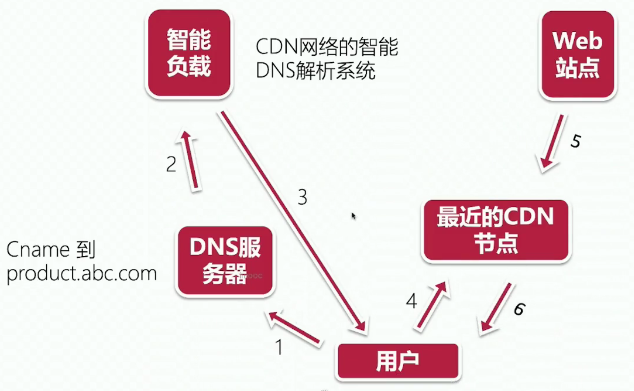

### go语言生成静态页面，类似django的render template

### 静态资源添加CDN
1. 原来和作用 
2. 阿里云添加CDN
 去管理平台上CDN菜单栏，添加域名和对应的服务器IP地址，会生成一个CName
 把CName加到域名解析里，并填写子域名
3. 部署前端静态资源
 部署一个只提供静态页面的服务到服务器上，并使用80端口，然后通过域名访问静态页面时会自动通过CDN